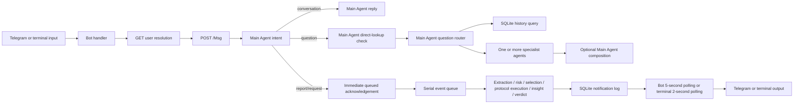

# Main Agent Response Speed and Quality Improvement Report

Date: 2026-08-28  
Scope: the complete path from user input to the final response delivered through Telegram or either terminal client.  
Status: analysis and implementation plan only; this document does not claim that the proposed changes have been implemented.

## 1. Executive summary

AgentsHub is correct to keep deterministic persistence, authorization, protocol enforcement, and history filtering outside the model. Its largest remaining response-time costs are not Python parsing or SQLite itself. They are the number of sequential model calls, queue head-of-line blocking, notification polling delay, repeated runtime construction, and avoidable local HTTP/database work.

The most important quality risk is closely related: every additional model decision is another nondeterministic boundary. The project validates many outputs, but it still uses prompt-requested text formats for several decisions, retries some malformed outputs by repeating the same request, and lacks a production-shaped evaluation suite that measures routing, tool choice, history-filter accuracy, groundedness, and final-answer usefulness together.

The recommended order is:

1. Measure stage latency and establish task-specific quality evaluations before changing the decision chain.
2. Remove transport and delivery delay that does not require model changes.
3. Collapse consecutive planning calls and use provider-native structured output where supported.
4. Reuse model/runtime and HTTP resources, and batch SQLite reads.
5. Add bounded parallelism only where independence and side-effect safety are explicit.
6. Select models and reasoning effort per stage using evaluation results, not intuition.
7. Add streaming or progressive feedback after the underlying latency work is measurable.

This ordering follows the main themes in OpenAI's latency guidance: generate fewer tokens, make fewer requests, parallelize independent work, reduce perceived wait, and avoid using an LLM for deterministic work. The guide also notes that output generation is usually the dominant latency component, whereas reducing ordinary-sized input prompts often provides only a small improvement. See [OpenAI latency optimization](https://developers.openai.com/api/docs/guides/latency-optimization).

## 2. Evidence and methodology

Three evidence classes are used in this report:

- **Measured locally:** observed by running an existing repository benchmark/test on 2026-08-28.
- **Verified statically:** confirmed by tracing current production call sites and control flow.
- **Expected:** a reasoned performance effect that must still be confirmed with real provider and production-shaped benchmarks.

The existing measurement was run with:

```text
python -m pytest tests/test_integration_cost_and_latency_review.py -q -s
```

Observed result:

```text
full run main-agent calls:
  extraction=1, risk_assessment=1, protocol_selection=1,
  task_formulation=1, judgment=1
insights-agent calls: 1
mocked-model submission-to-persisted-outcome latency: 348.6 ms
precedent-closed run:
  extraction=1, risk_assessment=1, protocol_selection=1,
  task_formulation=0, judgment=0, insights=0
```

The 348.6 ms result is useful only as a local orchestration baseline. All model calls were mocked, so it is not a real user latency measurement. With a live provider, sequential inference time will dominate.

The existing `docs/cost_latency_review.md` total of six model calls for a full one-step sensor event is inconsistent with its own stage table and current code. The verified total is seven:

1. extraction by Main Agent;
2. risk assessment by Main Agent;
3. protocol selection by Main Agent;
4. task formulation by Main Agent;
5. one specialist execution call;
6. insight generation by Insights Agent;
7. final judgment by Main Agent.

A Telegram report adds intent classification before queuing, producing eight model calls from input to final outcome for a successful one-step run. Retries and additional protocol steps can increase this number.

## 3. Current end-to-end paths



### 3.1 Verified model-call counts

The counts below are for successful first attempts. `N` is the number of selected question specialists or protocol steps.

| Input path | Calls before the first client response | Calls through final answer/outcome | Notes |
|---|---:|---:|---|
| Ambiguous intent | 1 | 1 | A clarification question is returned directly. |
| Conversation | 2 | 2 | Intent, then conversational generation. |
| Most-recent-event question | 2 | 2 | Intent, direct-lookup classifier, then deterministic SQLite rendering. |
| Structured history count/list/aggregate | 3 | 3 | Intent, direct-lookup classifier, question router; deterministic database answer. |
| Narrative history question | 3 | 4 | Adds History Agent synthesis after bounded retrieval. |
| One-specialist question | 4 | 4 | Intent, direct check, routing, specialist. |
| Multi-specialist question | `3 + N + 1` | same | Adds one final composition call after all specialists. |
| One-step Telegram request | 1 | 7 | Immediate acknowledgement after intent; queued path adds risk, selection, formulation, specialist, insight, judgment. |
| One-step Telegram report | 1 | 8 | Request path plus extraction. |
| One-step sensor event | 0 | 7 | No intent classification on `POST /Event`. |
| Precedent-closed sensor event | 0 | 3 | Extraction, risk, selection; later stages are skipped. |

### 3.2 Verified latency and quality bottlenecks

| Finding | Evidence in the current code | Effect |
|---|---|---|
| Every Telegram message pays for model intent classification before the API responds. | `api/routes.py:108-162` | Raises time to acknowledgement and time to direct answers. |
| Normal questions perform a separate direct-lookup model call before the general router. | `orchestrator/reasoning.py:747-773` | One avoidable sequential call for nearly every non-trivial question. |
| Multiple question specialists run serially. | `orchestrator/reasoning.py:791-815` | Latency grows approximately with the sum, rather than the maximum, of independent specialist calls. |
| Protocol steps run serially. | `protocols/executor.py:93-125` | Correct for dependent or side-effecting steps, but unnecessarily slow for explicitly independent read-only steps. |
| The entire asynchronous event workload has one worker. | `orchestrator/event_queue.py:13-66` | One slow model/tool call blocks every later event, even when events are unrelated. |
| Each agent call rebuilds CrewAI tools, LLM wrapper, and Agent. | `agents/runtime.py:151-170` | Repeated local setup and schema construction on every model call. |
| Telegram performs user resolution and then `/Msg`, which authenticates again. | `bot/app.py:99-113`; `api/routes.py:90-109` | Two local HTTP round trips and duplicate authorization-related work before processing. |
| The HTTP client uses `urllib.request` per request and supplies no explicit timeout. | `bot/transports.py:42-71` | No managed connection pool; a network stall can consume the whole perceived response budget. |
| Final Telegram delivery is discovered by polling every five seconds. | `bot/background_services.py:75-98` | Adds 0-5 seconds of delivery delay, approximately 2.5 seconds on average if completion time is uniformly distributed. |
| Terminal delivery polls every two seconds by default. | `tools/terminal_client_commander.py:63-88`; `tools/terminal_client_viewer.py:35-55` | Adds 0-2 seconds of delivery delay, approximately 1 second on average. |
| History list reads issue one step query per event. | `persistence/sqlite_store.py:247-253,345-360` | A 100-event result performs 101 SQL statements: one event query plus 100 `event_steps` queries. |
| Every SQLite read opens and closes a connection. | `persistence/sqlite_store.py:242-245` and all read methods | Small per-query overhead that becomes material with repeated/N+1 reads. |
| Stable question-routing context is placed after the dynamic question. | `orchestrator/reasoning.py:599-620` | Prevents effective prefix reuse by providers that cache identical prompt prefixes. |
| Stage context labels calls but does not record elapsed duration. | `tools/observability.py:44-50` | There is no production p50/p95/p99 evidence for queue wait, model time, database time, notification lag, or total latency. |
| Several output contracts rely on requested text formats and application parsing. | `orchestrator/reasoning.py` risk, protocol, formulation, and judgment parsers | Formatting errors cause retries or failures and consume latency without improving semantic quality. |
| Some retries repeat almost the same call immediately. | `orchestrator/flows.py:521-560` | Deterministic formatting failures may repeat; transient failures and semantic repair are not distinguished. |

## 4. Target service-level indicators

Do not set an absolute production SLO from mocked calls. First record at least one week of representative traffic or run a controlled live-model workload. Track these metrics by route, model, provider, profile, and stage:

- end-to-end latency from client input to first visible feedback;
- end-to-end latency from input to durable final answer;
- end-to-end latency from input to Telegram/terminal delivery;
- queue wait time and queue depth;
- model time to first token, total model latency, input/output tokens, cache-read tokens, retry count, and timeout count;
- database query duration and rows examined/returned;
- notification commit-to-delivery lag;
- intent accuracy, clarification rate, and false-request rate;
- question route/tool selection accuracy;
- history filter exact match and source-grounding accuracy;
- final answer correctness, completeness, concision, and human usefulness;
- side-effect safety violations and duplicate tool effects.

Use histograms, not averages alone. OpenTelemetry defines traces as the path of a request through an application and histograms as compressed distributions suitable for questions such as p99 latency. See [OpenTelemetry signals](https://opentelemetry.io/docs/concepts/signals/) and the [OpenTelemetry metrics data model](https://opentelemetry.io/docs/specs/otel/metrics/data-model/).

Initial improvement targets should be relative to the captured live baseline:

- no regression in intent, route, history-filter, or side-effect-safety evaluations;
- at least 30% lower p50 latency for direct questions;
- at least 20% lower p95 latency for one-step report/request completion;
- notification commit-to-client p95 below 500 ms after long polling or push delivery;
- zero unbounded network waits;
- zero model-format retries on providers supporting strict structured output;
- no increase in duplicate side effects or out-of-order protocol steps.

These are proposed engineering gates, not claims about current performance.

## 5. Prioritized implementation plan

## Phase 0 - Build the measurement and quality gate

### 5.1 Add true end-to-end tracing and latency histograms

**Why first:** optimizing without stage measurements can move latency between components or reduce quality invisibly.

**Implementation steps:**

1. Extend `stage_context()` to record monotonic start/end time and success/failure.
2. Add spans or structured timing events for:
   - Telegram handler;
   - user resolution and `/Msg`;
   - API request;
   - queue wait and queue execution;
   - each model invocation, including time to first token when available;
   - each tool call;
   - each SQLite operation;
   - notification commit, poll receipt, and Telegram send.
3. Propagate one trace ID from Telegram/terminal through `X-Trace-ID`, the event/job row, queue callback, notification payload, and final send.
4. Record model/provider/stage, input tokens, output tokens, cache-read tokens, attempt number, and terminal status. Never log API keys or unrestricted prompts by default.
5. Export route/stage histograms with boundaries suitable for seconds-long LLM operations, not only millisecond HTTP calls.

**Files:** `tools/observability.py`, `agents/runtime.py`, `bot/transports.py`, `api/app.py`, `api/routes.py`, `orchestrator/event_queue.py`, `persistence/sqlite_store.py`.

**Acceptance:** a single trace reconstructs client input to client output; p50/p95/p99 can be calculated per route and stage; tracing adds less than 2% p50 overhead in the mocked benchmark.

**Evidence:** [OpenTelemetry signals](https://opentelemetry.io/docs/concepts/signals/) and [metrics histograms](https://opentelemetry.io/docs/specs/otel/metrics/data-model/).

### 5.2 Create a production-shaped evaluation corpus

**Implementation steps:**

1. Create versioned local JSONL fixtures for Hebrew and English messages covering:
   - all five intent outcomes;
   - negation, quotation, hypothetical language, mixed social/operational text, and prompt injection;
   - follow-ups with and without enough context;
   - every history operation and time basis;
   - valid and invalid areas, event types, outcomes, protocols, event IDs, and risk levels;
   - single- and multi-specialist questions;
   - high-risk action requests and ambiguous protocol matches.
2. Score each model boundary independently: intent, history query specification, specialist selection, protocol selection, task formulation, insight, and judgment.
3. Add end-to-end answer scoring for correctness, source support, completeness, unnecessary verbosity, and safe refusal/clarification.
4. Use deterministic checks wherever possible. Use pairwise or rubric-based human/model grading only for genuinely semantic answers.
5. Mine anonymized production failures and low-rated answers into the corpus.
6. Pin evaluated model snapshots. Re-run the corpus before changing model, prompt, provider, schema, or concurrency behavior.

**Files:** add a dedicated non-pytest billed evaluation runner under `tests/` or `tools/`; extend the existing `tests/sanity_check_real_model_call.py`; keep unit tests offline.

**Acceptance:** per-class intent precision/recall, route accuracy, history-filter exact match, tool-argument accuracy, groundedness, and pairwise answer preference are reported separately; typical, edge, and adversarial cases are represented.

**Evidence:** OpenAI recommends eval-driven development, task-specific datasets matching real traffic, continuous evaluation, logging, and human calibration. It also recommends evaluating each model interaction in a multi-step workflow separately. See [OpenAI evaluation best practices](https://developers.openai.com/api/docs/guides/evaluation-best-practices). Although OpenAI's hosted legacy Evals product has a published deprecation schedule, these evaluation principles and a local provider-neutral harness remain applicable.

## Phase 1 - Remove non-model latency safely

### 5.3 Eliminate the duplicate bot user-resolution request

**Current state:** `handle_incoming_message()` calls `GET /User/<identity>`, then `POST /Msg`; `/Msg` authenticates and authorizes the same identity again.

**Implementation steps:**

1. Make `/Msg` the single authority for registration and permission on free-text messages.
2. Preserve the current user-facing refusal text by mapping the API's 401/403 response in `HttpApiClient.submit_message()`.
3. Keep explicit user resolution for commands that require the caller object or display permission-specific data.
4. Add tests proving unknown users, viewers, and commanders retain identical authorization behavior.

**Expected effect:** one fewer localhost request on every free-text Telegram message.

**Files:** `bot/app.py`, `bot/transports.py`, `api/request_boundary.py`, related bot/API tests.

### 5.4 Use a persistent async HTTP client with explicit deadlines

**Implementation steps:**

1. Replace per-call `urllib.request.urlopen()` with one lifecycle-managed async client per bot/terminal process.
2. Reuse TCP connections and configure bounded connection-pool size.
3. Configure separate connect, read, write, and pool timeouts.
4. Propagate the trace ID and a client request ID in headers.
5. Close the client cleanly during bot/terminal shutdown.
6. Retry only idempotent GETs and explicitly idempotent submissions, using bounded exponential backoff with jitter. Do not blindly retry action submissions.

**Files:** `bot/transports.py`, `bot/contracts.py`, `bot/app.py`, `tools/terminal_support.py`, entry-point shutdown paths.

**Acceptance:** connection reuse is demonstrated by a transport test; a stalled API produces a bounded error; no background thread is leaked; duplicate message submission cannot occur.

**Evidence:** HTTPX documents that a client pool reuses TCP connections and reduces handshakes, round trips, CPU use, and latency; it also exposes distinct connect/read/write/pool timeouts. See [HTTPX clients](https://www.python-httpx.org/advanced/clients/) and [HTTPX timeouts](https://www.python-httpx.org/advanced/timeouts/). AWS recommends bounded retries with exponential backoff and jitter and emphasizes idempotency and fail-fast handling; see [AWS retry behavior](https://docs.aws.amazon.com/sdkref/latest/guide/feature-retry-behavior.html).

### 5.5 Replace short notification polling with long polling

**Implementation steps:**

1. Extend `GET /Notifications` with a bounded `wait_seconds` parameter, for example 20 seconds.
2. If no row exists after `since`, wait on an in-process condition/event that is signaled only after the notification transaction commits.
3. Return immediately when notifications exist; return an empty result at the timeout.
4. Reconnect immediately after each response. Apply jittered backoff only after transport errors.
5. Retain the cursor contract so restart, deduplication, and at-least-once safety remain unchanged.
6. Use the same long-poll client in Telegram and both terminal tools.
7. Confirm the deployment server supports the required concurrent long-held requests; do not rely on Flask's development server for production capacity.

**Expected effect:** removes most of the current 0-5 second Telegram and 0-2 second terminal delivery lag without creating a new message broker.

**Files:** `api/routes.py`, `persistence/contracts.py`, `persistence/sqlite_store.py`, `bot/background_services.py`, terminal clients.

**Acceptance:** commit-to-delivery p95 below 500 ms under normal local load; no missed or duplicate notifications across timeout, reconnect, and process restart tests.

**Evidence:** Telegram itself uses long polling for updates and states that the timeout should be positive and short polling should be used only for testing. See [Telegram Bot API `getUpdates`](https://core.telegram.org/bots/api#getupdates).

### 5.6 Batch history step loading and reuse read connections

**Implementation steps:**

1. Change range/search methods to fetch all matching events first.
2. Fetch all related steps in one query using bounded `event_id IN (...)` batches.
3. Group steps by event ID in Python and attach them deterministically by `step_index`.
4. Add a small thread-local or scoped read-connection strategy instead of opening a connection for each method call. Keep transactions short.
5. Use `EXPLAIN QUERY PLAN` in performance tests for the most frequent filter/order combinations.
6. Run `ANALYZE` after migrations or large fixture loads when representative statistics are available.
7. Add expression indexes for day/month grouping only if measured query plans and traffic justify them; SQLite requires the indexed expression to match the query expression.

**Files:** `persistence/sqlite_store.py`, `persistence/schema.py`, history integration/performance tests.

**Acceptance:** a 100-event history list performs a bounded constant number of SQL statements rather than 101; query results and order are byte-equivalent; p95 improves on databases at realistic sizes.

**Evidence:** SQLite explains that multi-column/covering indexes can satisfy filtering and ordering while avoiding temporary sorting and extra table lookups. See [SQLite query planner](https://www.sqlite.org/queryplanner.html). Expression indexes are used only when the query expression matches the indexed expression; see [SQLite indexes on expressions](https://www.sqlite.org/expridx.html). WAL permits readers and a writer to proceed concurrently, but checkpoint behavior must be monitored; see [SQLite WAL](https://www.sqlite.org/wal.html).

### 5.7 Reuse immutable agent runtime objects

**Implementation steps:**

1. Benchmark separately the time spent in `_get_crewai()`, tool-class construction, LLM wrapper creation, Agent construction, and `kickoff()`.
2. Cache immutable tool schemas/classes per `AgentDescriptor`.
3. Reuse provider client/LLM objects when the provider contract declares them thread-safe.
4. Reuse CrewAI Agent instances only after concurrency tests prove that invocation-local state does not leak between requests. Otherwise cache only safe lower-level objects.
5. Keep `allowed_tools` invocation-local through the existing `ContextVar`; test concurrent calls with disjoint tool allowlists.
6. Invalidate caches when the profile, model, system prompt, or tool descriptors change.

**Files:** `agents/runtime.py`, profile reload paths, concurrency tests.

**Acceptance:** no cross-request tool authorization leakage; warm-call setup time is materially lower; outputs and model-call counts remain unchanged.

## Phase 2 - Reduce sequential model calls

### 5.8 Merge intent classification and question planning

This is the highest-value model-path change.

**Current state:** a normal question uses intent classification, a separate most-recent classifier, and a general router before any data or specialist answer is produced.

**Implementation steps:**

1. Replace these calls with one structured `MessagePlan` response containing:
   - primary intent and evidence;
   - clarification question when required;
   - optional deterministic direct operation;
   - optional validated `HistoryQuerySpec`;
   - optional specialist tasks;
   - optional conversational response instruction.
2. Validate evidence, enum values, protocol names, specialist names, read-only tool names, and history filters exactly as today.
3. Execute deterministic history operations directly from the plan.
4. Retain a safe clarification fallback when the plan is invalid or ambiguous.
5. Keep the old path behind a temporary feature flag for paired evaluation and rollback.
6. Compare both paths on the full routing corpus before enabling the merged planner.

**Expected effect:**

- most-recent history question: two model calls become one;
- structured history question: three become one;
- one-specialist question: four become two;
- conversation can potentially become one call if the planner is allowed to return the final short response.

**Files:** `orchestrator/reasoning.py`, `api/routes.py`, history contracts, routing tests.

**Acceptance:** no statistically meaningful quality regression; all exact validation and authorization behavior remains; malformed output never becomes a request.

**Evidence:** OpenAI's latency guide explicitly identifies consecutive model calls as a likely inefficiency and recommends combining dependent planning calls into one request. See [OpenAI latency optimization, architecture example](https://developers.openai.com/api/docs/guides/latency-optimization).

### 5.9 Use provider-native strict structured output

**Implementation steps:**

1. Add a provider capability interface for JSON Schema/typed output.
2. Define strict schemas for `MessagePlan`, risk assessment, protocol selection, task formulation, history query planning, and final verdict.
3. Use native schema enforcement when supported; retain the current validated parser as a provider-neutral fallback.
4. Treat explicit provider refusal separately from invalid formatting.
5. Remove format-repair retries only after schema conformance is verified for the configured provider/model.
6. Keep semantic validation in application code; schema validity does not prove that evidence or selected names are correct.

**Expected effect:** fewer parse failures, fewer retries, smaller formatting prompts, and more reliable downstream decisions.

**Evidence:** OpenAI states that Structured Outputs adhere to a supplied JSON Schema, prevent missing keys and invalid enum values, and reduce the need to retry incorrectly formatted responses. See [OpenAI Structured Outputs](https://developers.openai.com/api/docs/guides/structured-outputs).

### 5.10 Evaluate merging risk assessment and protocol selection

Both decisions consume the same event fields, settings, and protocol catalog. They currently run consecutively.

**Implementation steps:**

1. Define a single structured `OperationalDecision` containing risk score/reason and protocol selection/status/reason.
2. Preserve deterministic thresholding in code: the model returns a score; application code derives high/low.
3. Preserve all protocol membership, ambiguity, criticality, approval, and no-match validation.
4. Run paired evaluations with special weighting for high-risk false negatives and wrong protocol selection.
5. Enable only if risk and protocol metrics are non-inferior. Otherwise retain two calls or use the merged call only for low-risk/high-confidence cases.

**Expected effect:** one fewer sequential core-model call on every request/report that reaches risk assessment.

**Risk:** this combines two independent checks and can correlate errors. Quality evaluation is mandatory.

### 5.11 Avoid unconditional insight plus judgment calls

The current finalization uses an Insights Agent and then asks Main Agent to judge the same run with the insight included.

**Implementation options to evaluate:**

1. One structured final-assessment call returns insight, verdict, and reasoning.
2. Use one final call for low-risk routine runs, but retain an independent second verifier for high-risk, uncertain, or policy-sensitive runs.
3. Retain both calls if paired evaluations show that independent judgment materially catches errors.

Do not remove the second call solely for speed. This boundary may provide real quality value; the decision must be driven by disagreement and error-catch measurements.

### 5.12 Make deterministic fast paths narrow and auditable

**Implementation steps:**

1. Add fast paths only for explicit, unambiguous commands or exact query shapes, such as a formally supported latest-event command.
2. Require high precision; fall back to the model on any ambiguity.
3. Never use keyword matching to infer operational requests with side effects.
4. Log fast-path selection and include it in routing evaluations.
5. Cache only safe deterministic results, keyed by profile version, permission scope, normalized query, and the latest relevant database sequence.

**Evidence:** OpenAI includes "do not default to an LLM" among its core latency principles. See [OpenAI latency optimization](https://developers.openai.com/api/docs/guides/latency-optimization).

## Phase 3 - Improve prompt and model efficiency

### 5.13 Make prompts cache-friendly

**Implementation steps:**

1. Put stable system instructions, schemas, agent descriptors, tool definitions, protocol data, and history vocabulary first.
2. Put the dynamic user message, current time, retrieved events, and retry details at the end.
3. Keep serialization ordering stable and avoid injecting changing trace IDs into the cached prefix.
4. Record cache-read tokens/hit rate when the provider exposes them.
5. Do not enable extended retention without reviewing the provider's data-retention implications.

The question router currently puts the dynamic question before stable agent and history data; reorder it.

**Evidence:** prompt caching requires an identical rendered prefix and reduces time before output begins. OpenAI recommends placing static content first and dynamic content later. See [OpenAI prompt caching](https://developers.openai.com/api/docs/guides/prompt-caching).

### 5.14 Set stage-specific output and reasoning budgets

**Implementation steps:**

1. Add stage configuration for maximum output tokens, desired verbosity, timeout, and reasoning effort where the provider supports them.
2. Keep classifier/planner outputs minimal and schema-only.
3. Cap specialist and final-answer output according to Telegram and task needs.
4. Allow larger budgets only for narrative history synthesis or complex specialist work.
5. Record truncation and provide a safe continuation path rather than silently returning incomplete structured data.

**Evidence:** OpenAI reports that output generation is usually the largest LLM latency component and gives the heuristic that halving output tokens may approximately halve generation latency. See [OpenAI latency optimization](https://developers.openai.com/api/docs/guides/latency-optimization).

### 5.15 Select a model tier per stage, gated by evals

**Implementation steps:**

1. Separate configuration for planner/classifier, specialist, history synthesis, insight, and verifier models.
2. Benchmark a smaller/faster model for intent, structured history planning, risk scoring, protocol selection, and formatting.
3. Keep the stronger model for ambiguous planning, high-risk decisions, synthesis, and adjudication until evidence supports promotion of a faster tier.
4. Route low-confidence or schema-repair cases upward to the stronger tier.
5. Pin model snapshots and re-run evaluations before upgrades.

**Evidence:** OpenAI notes that smaller models usually run faster and can outperform larger models on focused tasks when paired with detailed prompts, examples, or fine-tuning. See [OpenAI latency optimization](https://developers.openai.com/api/docs/guides/latency-optimization). Provider/model selection must remain profile-driven; no recommendation here requires OpenAI specifically.

## Phase 4 - Add safe concurrency and capacity controls

### 5.16 Parallelize independent question specialists

**Implementation steps:**

1. Mark selected question tasks as independent and read-only in the validated plan.
2. Execute them with bounded concurrency.
3. Preserve deterministic result ordering by the planner's task order.
4. Apply one shared deadline; cancel remaining work when the request is cancelled or cannot complete usefully.
5. Propagate trace and allowed-tool context into every task.
6. Enforce provider rate limits and a maximum per-request fan-out.

**Expected effect:** multi-specialist latency approaches the slowest specialist plus composition time rather than the sum of all specialist times.

**Evidence:** OpenAI recommends parallelizing independent work. CrewAI documents asynchronous kickoff and running independent crews through `asyncio.gather`; see [CrewAI asynchronous kickoff](https://docs.crewai.com/en/learn/kickoff-async).

### 5.17 Add explicit protocol-step dependencies before parallelizing them

Do not parallelize the current ordered step list automatically.

**Implementation steps:**

1. Extend protocol definitions with explicit dependencies or parallel groups.
2. Permit parallel execution only when all tools are read-only or explicitly idempotent and resource conflicts are absent.
3. Keep side-effecting or dependent steps serial.
4. Persist each outcome with its stable protocol step index, regardless of completion order.
5. Stop downstream dependents after failure while allowing already-started safe independent work to finish or cancel according to policy.
6. Add race, ordering, partial-failure, retry, and duplicate-side-effect tests.

### 5.18 Replace the global serial event queue with bounded, policy-aware concurrency

**Implementation steps:**

1. Measure queue wait separately from execution before changing it.
2. Introduce a bounded worker pool for unrelated events.
3. Preserve strict per-event ordering.
4. Add concurrency keys for shared resources and side-effecting tools so conflicting actions remain serialized.
5. Prioritize interactive continuations/holds over new background events where policy allows.
6. Add admission control and a maximum queue size; reject or defer safely instead of accepting unbounded backlog.
7. Keep the SQLite single-writer contract initially; WAL allows concurrent readers while writes remain serialized.

**Risk:** this is a behavioral and operational change. It must follow idempotency, ordering, and load tests.

### 5.19 Use deadline-aware retries

**Implementation steps:**

1. Give each client request/job an end-to-end deadline.
2. Pass the remaining budget to every model, tool, database, and transport call.
3. Classify failures as transient transport, throttling, provider refusal, invalid structure, unclear task, or permanent application error.
4. Retry only categories that can improve, and only when the operation is safe to repeat.
5. Use exponential backoff with jitter for transient provider/HTTP failures.
6. Use a targeted repair prompt for invalid structure or unclear tasks; do not repeat an identical malformed request.
7. Stop when the remaining budget cannot support another useful attempt.

**Evidence:** AWS documents exponential backoff with jitter, retry quotas, and fail-fast behavior to prevent retries from magnifying failures. See [AWS retry behavior](https://docs.aws.amazon.com/sdkref/latest/guide/feature-retry-behavior.html).

## Phase 5 - Improve perceived latency and response presentation

### 5.20 Add immediate Telegram activity feedback

**Implementation steps:**

1. Start `sendChatAction(action="typing")` when a direct answer will take noticeable time.
2. Refresh it before Telegram's five-second expiry while work continues.
3. Stop on completion, cancellation, or error.
4. Do not send noisy textual "please wait" messages.
5. Show equivalent stage feedback in the terminal only when interactive verbosity is enabled.

This does not reduce compute latency, but it reduces uncertainty and makes the wait visible.

**Evidence:** Telegram recommends `sendChatAction` when a response will take noticeable time and states that the status lasts at most five seconds. See [Telegram Bot API `sendChatAction`](https://core.telegram.org/bots/api#sendchataction).

### 5.21 Add streaming only after the model adapter supports it end to end

**Implementation steps:**

1. Add an optional streaming interface at the provider/agent boundary while retaining the existing final `AgentResult` contract.
2. Stream only user-facing conversational, specialist, history narrative, and final-composition text; never expose intermediate chain-of-thought or unvalidated structured decisions.
3. For Telegram versions that support it, use `sendMessageDraft` with local rate limiting, then persist the final response with `sendMessage`.
4. For older clients/libraries, send one placeholder and edit it at a controlled cadence.
5. Stream to terminal stdout immediately.
6. Persist and evaluate only the finalized answer.

**Evidence:** Telegram's current Bot API defines `sendMessageDraft` specifically for streaming a partial message while it is generated and requires a final `sendMessage` to persist the answer. See [Telegram Bot API `sendMessageDraft`](https://core.telegram.org/bots/api#sendmessagedraft). CrewAI also documents asynchronous streaming output in its async kickoff guide: [CrewAI asynchronous kickoff](https://docs.crewai.com/en/learn/kickoff-async).

## 6. Quality-specific improvements

### 6.1 Return provenance with history answers

The service already carries `HistorySource` internally. Expose concise provenance in user answers:

- applied time range and timezone;
- filters used;
- matched count and truncation status;
- event IDs or summary periods supporting the answer.

For deterministic count/aggregate/list operations, render directly from the database. For narrative answers, require the final text to be supported by the bounded retrieved records and detect unsupported event IDs or values before returning it.

### 6.2 Add conversational follow-up context deliberately

The intent model can detect a follow-up without context but the message path does not supply prior turns. Add a small, explicit conversation context store keyed by deployment, chat, and user:

1. retain only the minimum recent turns required for references such as "that event";
2. store or expire context according to privacy policy;
3. rewrite the follow-up into a self-contained query in the combined planner;
4. never let conversational memory replace database history or authorization;
5. show clarification when the referent is still ambiguous.

Evaluate pronoun/reference resolution separately. This can improve both answer quality and avoid unnecessary clarification turns.

### 6.3 Make confidence actionable, not decorative

Do not ask the model for an uncalibrated numeric confidence score and trust it directly. Use observable signals:

- schema validity;
- exact evidence presence;
- registry/tool/protocol membership;
- number and closeness of protocol candidates;
- retrieval count and source coverage;
- agreement between a primary decision and verifier on high-risk cases;
- evaluation-derived error rates for the active model/version.

Use these signals to choose direct execution, stronger-model escalation, or clarification.

### 6.4 Keep answers concise but complete

Define route-specific response contracts:

- conversation: brief natural answer;
- deterministic history: answer first, then filters/count/source IDs;
- narrative history: conclusion, evidence, limitations;
- job result: outcome, completed steps, insight, and failure/uncertainty reason;
- clarification: one specific question with valid examples or buttons when possible.

This reduces output latency and makes Telegram responses easier to scan without hiding operational evidence.

## 7. Verification matrix for every optimization

| Change | Latency proof | Quality proof | Safety/behavior proof |
|---|---|---|---|
| Remove duplicate user lookup | Bot-to-API request count and end-to-end p50 | Same refusal/help text | Authorization matrix unchanged |
| HTTP pool/timeouts | Connection reuse and stalled-server test | Error messages remain actionable | No duplicate non-idempotent submission |
| Long polling | Commit-to-delivery p50/p95/p99 | Same payload and order | Cursor restart/dedup tests |
| Batch history reads | SQL statement count and large-DB benchmark | Exact result/order equivalence | Parameterized queries only |
| Runtime caching | Warm-call setup benchmark | Paired outputs/evals | Concurrent tool-allowlist isolation |
| Combined message planner | Model-call and direct-answer latency | Full routing/history/tool eval | Invalid output cannot cause action |
| Strict schemas | Parse-retry count | Semantic validators/evals | Provider fallback retained |
| Model tiering | Stage p50/p95 and token use | Non-inferiority per stage | High-risk escalation works |
| Specialist concurrency | Multi-agent critical-path latency | Same composed answer inputs | Bounded fan-out/cancellation |
| Event worker pool | Queue-wait and throughput load test | Same per-event outcomes | Ordering/idempotency/resource locks |
| Streaming | Time to first visible text | Final answer equal to stored answer | No chain-of-thought or unvalidated data leak |

Every phase must continue to pass the complete existing test suite. Add tests; do not weaken current assertions, timeouts, authorization checks, persistence guarantees, or side-effect rules to make a performance change pass.

## 8. Recommended delivery sequence

### Release A - observability and evaluation

- stage timers, trace propagation, model/token/cache metrics;
- live benchmark runner and production-shaped eval corpus;
- corrected model-call documentation.

Exit gate: trustworthy baseline and quality scorecard exist.

### Release B - low-risk transport/data improvements

- remove duplicate free-text user lookup;
- persistent async HTTP client and explicit timeouts;
- long-poll notification endpoint;
- batch event-step reads;
- Telegram typing feedback.

Exit gate: lower delivery/transport latency with identical decisions and outputs.

### Release C - fewer model requests

- combined intent/question planner;
- strict structured output capability;
- cache-friendly prompt ordering;
- stage output budgets;
- targeted retry repair.

Exit gate: routing and answer quality are non-inferior on held-out and adversarial evaluations.

### Release D - model and runtime optimization

- safe runtime/schema/client reuse;
- evaluated model tiering and reasoning budgets;
- optional risk/selection and insight/judgment consolidation.

Exit gate: live p50/p95 targets met with no high-risk quality regression.

### Release E - bounded concurrency and streaming

- parallel read-only question specialists;
- explicit protocol dependency graph;
- policy-aware event worker pool;
- progressive Telegram/terminal output.

Exit gate: load, ordering, cancellation, idempotency, and rate-limit tests pass.

## 9. Changes that should not be made blindly

- Do not parallelize ordered protocol steps based only on different agent names.
- Do not cache user-specific answers without permission, profile-version, and database-sequence keys.
- Do not replace validated database history with model memory.
- Do not retry side-effecting tools unless their idempotency contract is explicit and tested.
- Do not lower model quality for high-risk decisions based only on average latency.
- Do not remove the Insights/Judgment separation without measuring what errors the second call catches.
- Do not expose partial structured decisions or chain-of-thought through streaming.
- Do not tune SQLite indexes without representative query plans and database sizes; indexes also add write and storage cost.
- Do not set production latency SLOs from mocked-provider measurements.

## 10. Primary sources

1. [OpenAI - Latency optimization](https://developers.openai.com/api/docs/guides/latency-optimization): fewer requests/tokens, parallelization, perceived latency, deterministic alternatives, and prompt layout.
2. [OpenAI - Prompt caching](https://developers.openai.com/api/docs/guides/prompt-caching): identical prefix requirements, cache benefits, and stable-first prompt organization.
3. [OpenAI - Structured Outputs](https://developers.openai.com/api/docs/guides/structured-outputs): JSON Schema adherence, type safety, detectable refusals, and reduced formatting retries.
4. [OpenAI - Evaluation best practices](https://developers.openai.com/api/docs/guides/evaluation-best-practices): task-specific evals, production-shaped datasets, continuous evaluation, human calibration, and boundary-level workflow evaluation.
5. [CrewAI - Kickoff Crew Asynchronously](https://docs.crewai.com/en/learn/kickoff-async): async kickoff, gathering independent crews, and async streaming.
6. [Telegram Bot API - `getUpdates`](https://core.telegram.org/bots/api#getupdates): long polling and positive timeout guidance.
7. [Telegram Bot API - `sendChatAction`](https://core.telegram.org/bots/api#sendchataction): activity feedback for noticeable processing time.
8. [Telegram Bot API - `sendMessageDraft`](https://core.telegram.org/bots/api#sendmessagedraft): partial AI response streaming and final-message persistence.
9. [HTTPX - Clients](https://www.python-httpx.org/advanced/clients/): connection pooling and reduced request latency.
10. [HTTPX - Timeouts](https://www.python-httpx.org/advanced/timeouts/): connect, read, write, and pool deadlines.
11. [SQLite - Query planner](https://www.sqlite.org/queryplanner.html): multi-column and covering indexes, filtering, and sort avoidance.
12. [SQLite - Indexes on expressions](https://www.sqlite.org/expridx.html): exact expression matching requirements.
13. [SQLite - Write-Ahead Logging](https://www.sqlite.org/wal.html): reader/writer concurrency, checkpointing, and WAL tradeoffs.
14. [OpenTelemetry - Signals](https://opentelemetry.io/docs/concepts/signals/): traces, metrics, and logs.
15. [OpenTelemetry - Metrics data model](https://opentelemetry.io/docs/specs/otel/metrics/data-model/): histogram-based latency distributions.
16. [AWS - Retry behavior](https://docs.aws.amazon.com/sdkref/latest/guide/feature-retry-behavior.html): bounded exponential backoff, full jitter, retry quotas, and fail-fast behavior.

## 11. Final recommendation

The fastest safe route is not a wholesale rewrite. First make latency and quality visible. Then remove one redundant HTTP call, replace short notification polling, batch history reads, and reuse safe runtime resources. After that, the largest structural win is a single validated message planner that replaces intent plus direct-lookup plus question-routing calls. Only then introduce evaluated model tiering and bounded concurrency.

This sequence improves actual latency, perceived latency, and response quality while preserving the project's strongest property: models propose decisions, but application code validates permissions, names, schemas, history filters, ordering, persistence, and side effects.
